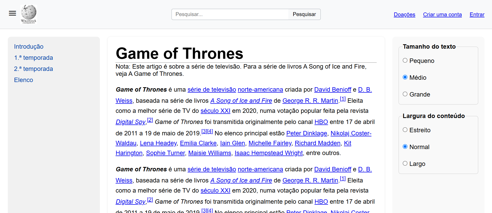

# 🌐 Meu Primeiro Site com HTML5 e CSS3

Este é um projeto simples feito para praticar a estruturação de páginas com **HTML5 semântico** e **estilização com CSS3**, incluindo boas práticas como acessibilidade, responsividade e organização de layout.

---

## 📄 Estrutura do Projeto

- **`index.html`**: Página principal com `header`, `main` e elementos semânticos como `<nav>`, `<article>`, `<aside>`, `<section>`, `<form>`, etc.
- **`style.css`**: Estilos do site, incluindo layout com Grid/Flexbox e responsividade para dispositivos móveis.
- **`assests/`**: Pasta onde estão as imagens usadas no site (como o logotipo).

---

## ✨ Funcionalidades

- Cabeçalho com:
  - Ícone de menu
  - Logotipo
  - Barra de pesquisa centralizada
  - Menu com links como “Doações”, “Criar uma conta” e “Entrar”
  
- Conteúdo principal dividido em 3 partes:
  - **Navegação lateral** com links âncora para seções da mesma página
  - **Artigo central** com parágrafos e seções identificadas
  - **Configurações visuais** (com radio buttons para alterar o tamanho e largura do texto — funcionalidade futura)

- Linha de separação com `
` entre seções
- Layout **responsivo** para telas menores

---

## 🎯 Tecnologias utilizadas

- HTML5
- CSS3 (com Flexbox e Grid)
- Ícones do Google Fonts (Material Symbols)

---

## 📷 Captura de tela (opcional)

---

## 🚀 Como executar

1. Clone ou baixe este repositório
2. Abra o arquivo `index.html` no navegador
3. Pronto! Seu site estará funcionando localmente

---

## 📚 Aprendizados

Este projeto me ajudou a entender:

- A importância das tags semânticas no HTML5
- Como criar layouts organizados com Grid/Flexbox
- Como aplicar responsividade e melhorar a acessibilidade básica

---

## 🔧 Melhorias futuras

- Adicionar interatividade com JavaScript (como trocar tamanho da fonte com os radios)
- Melhorar o visual com animações suaves
- Criar novas páginas a partir dos links

---

## 💻 Feito por

**Ana Carolina**  
Estudante de Ciência da Computação  
Desenvolvedora Front-End
